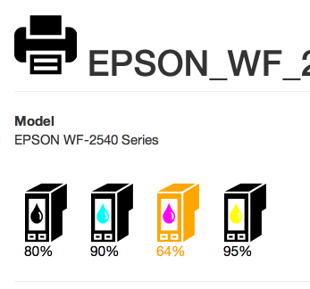

# cup-o-ink

**The Problem**: When I send a print job at work, if toner is low, I get a warning message that pops up. However, our IT staff, the ones who can actually address the issue, do not get any such notice.

**The Solution**: Delve into the CUPS API and find how to query toner status. Interface to it with [cupsffi][] and display it with rails. Point the IT staff at the interface. Profit.

[]
[cupsffi]: https://github.com/nehresma/cupsffi

## Notes
* This depends on a forked version of cupsffi for now. That's not good.
* This uses rougly 0% of the Rails-specific features, and should probably use something more lightweight.
* This is full of antipatterns.
* This needs tests.
